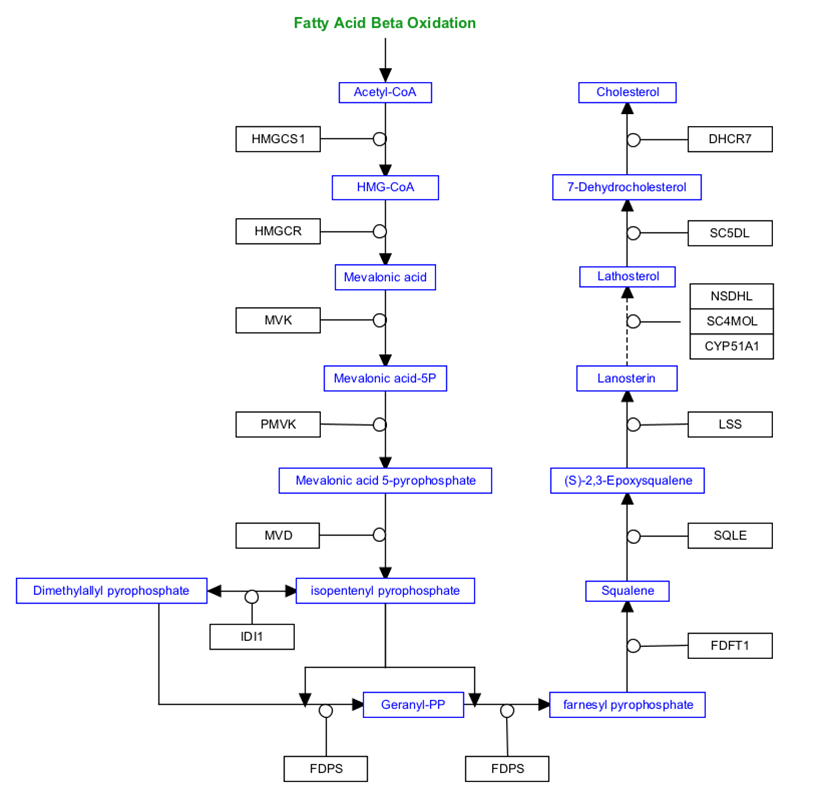
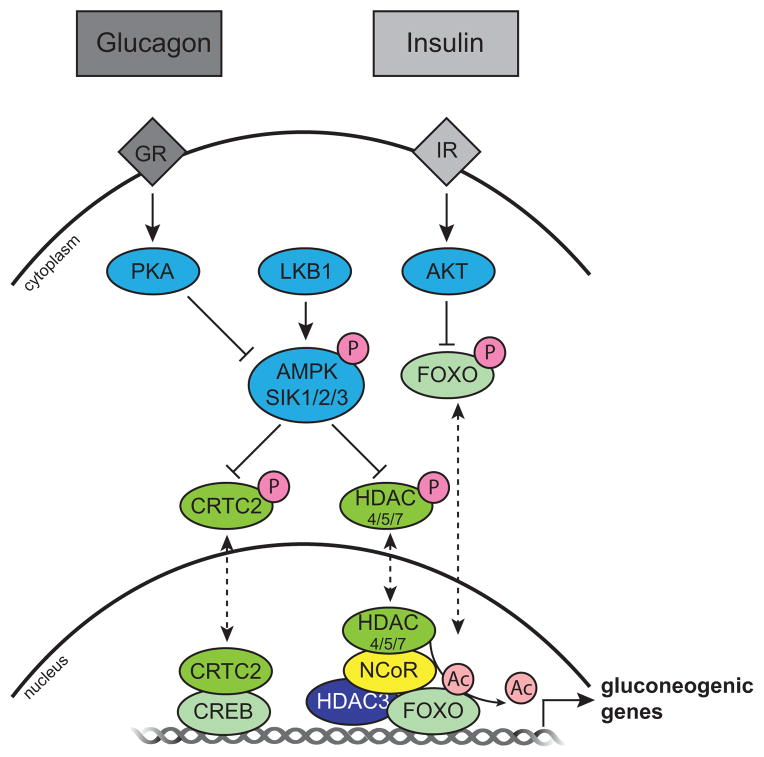
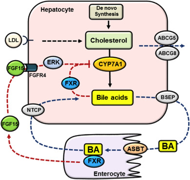

# Example Pathways For Drawing

Tutorial developed by Dr. Kristina Hanspers 

First, you can try drawing a piece of the Cholesterol Biosynthesis Pathway. Draw the piece from **Fatty Acid Beta Oxidation** to **Mevalonic Acid**.

Next, try drawing this pathway diagram from Figure 4 of the publication [Transcriptional coregulators: fine-tuning metabolism. Mouchiroud et al, Cell Metab, 2014](https://www.ncbi.nlm.nih.gov/pubmed/24794975)

Here is some information that can help you with the drawing. 
**Molecular model of kinase-mediated control of CRTC2 and HDAC4/5/7 subcellular localization and activity** The metabolic hormones glucagon and insulin signal through the glucagon receptor (GR) and insulin receptor (IR), respectively, to initiate signaling cascades downstream of changes in metabolic status. PKA and LKB1 phosphorylate (orange circles with a P) the AMPKRs (AMPK-Related Kinases), including AMPK and SIK1/2/3 which, when active, phosphorylate CRTC2 and HDAC4/5/7, resulting in their cytoplasmic sequestration. When unphosphorylated, CRTC2 and HDAC4/5/7 translocate to the nucleus (dashed lines) where they are free to promote the activation of gluconeogenic gene expression programs through CREB and the NCoR, HDAC3, FOXO complex, respectively. CRTC2 coactivates CREB, and nuclear FOXO is activated upon HDAC4/5/7-mediated deacetylation (light pink circles). In parallel, AKT phosphorylation regulates the activity of FOXO.

Finally, try drawing this pathway diagram from Figure 1 of the publication [Cholesterol and bile acid-mediated regulation of autophagy in fatty liver diseases and atherosclerosis. Wang et al, Biochim Biophys Acta Mol Cell Biol Lipids 2018](https://www.sciencedirect.com/science/article/pii/S1388198118300581#f0005).

Here is some information that can help you with the drawing. 
**Bile acid synthesis and enterohepatic circulation.** Hepatocytes acquire cholesterol via de novo synthesis and receptor-mediated endocytosis of cholesterol-rich lipoproteins. Hepatocytes eliminate cholesterol via bile acid synthesis and biliary secretion of cholesterol via ABCG5/ABCG8. Bile acids are synthesized from cholesterol in hepatocytes. CYP7A1 catalyzes the first and rate-limiting step in cholesterol conversion into bile acids. Bile acids are secreted into the bile via BSEP and subsequently released into the small intestine. The majority of bile acids is re-absorbed into the enterocytes via ASBT and transported back to the liver via portal circulation. Basolateral NTCP transports conjugated bile acids into the hepatocytes. Bile acids in the hepatocytes activate FXR to inhibit CYP7A1. Bile acids in the small intestine activate FXR to induce FGF15, which binds and activates FGFR4 to inhibit CYP7A1 partially via ERK signaling.

